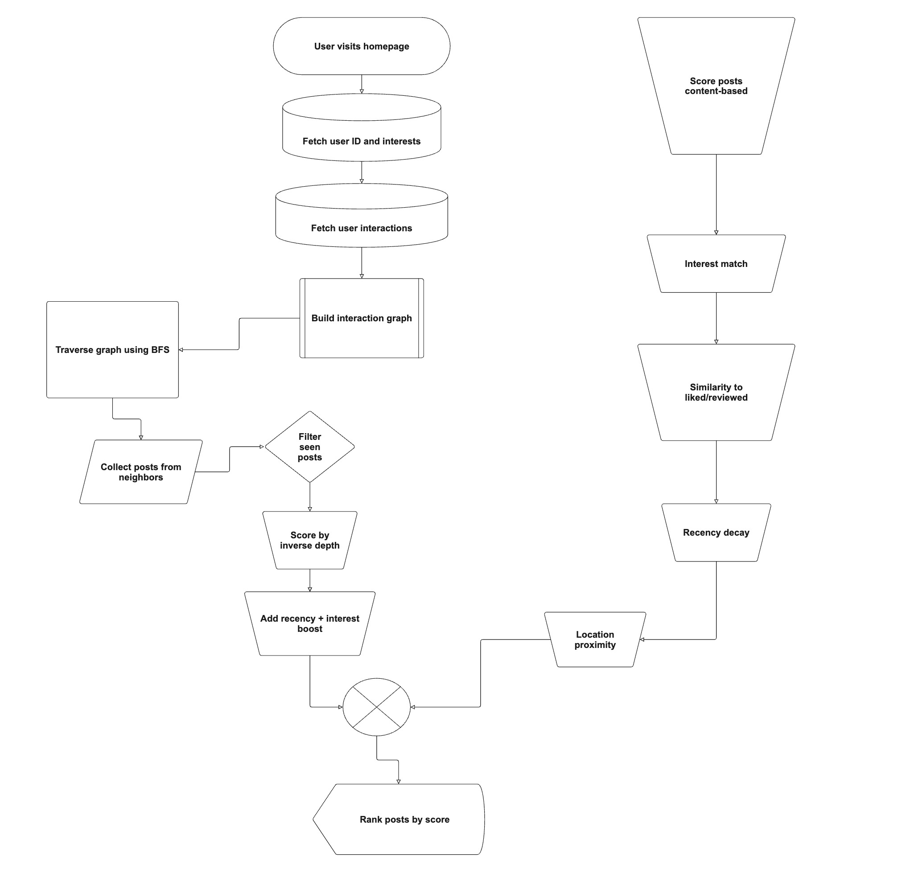
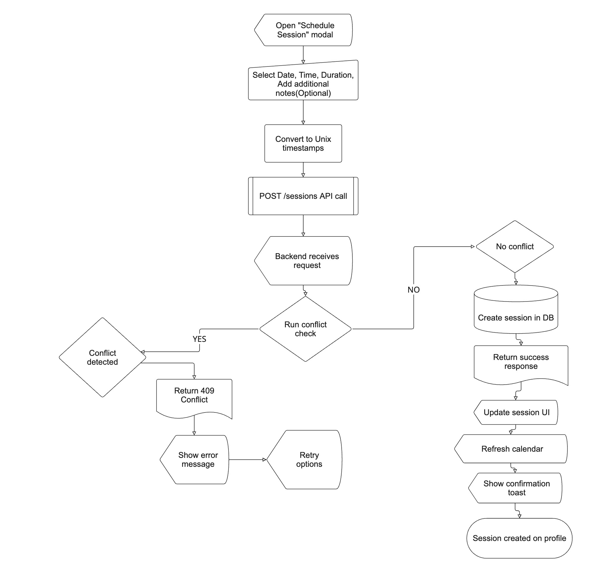

# Project Name: SkillSwap

**Intern:** Wellington Mapise

**Intern Manager:** Julianne Lin

**Intern Director:** Olivia Corrodi

**Peer(s):** Bilal Chaudhry, Smita Trivedi

**GitHub Repository Link:** [https://github.com/metaU-project/SkillSwap](https://github.com/metaU-project/SkillSwap)

**Deployed site**: [SkillSwap](https://skillswap-frontend-bews.onrender.com/)

## Project Plan

For detailed information about the project, please refer to the [Project Plan Document](https://docs.google.com/document/d/1q5PDm8L_pALFiUCXYNso6z2uid2x5GtOIc7O4y06Ptc/edit?usp=sharing).

## Demo Video

[TBD]

## Overview

SkillSwap is a community-driven platform designed to connect people who want to share or learn skills through informal sessions. The app facilitates skill exchange by enabling users to post skill offers or requests, search for relevant opportunities by category or location, and connect with others interested in peer-to-peer learning. This platform empowers users to grow their abilities and build local or online communities based on shared knowledge. SkillSwap is scalable, easy to use, and fosters continuous learning and collaboration especially at the workplace.

- Category: Education, Collaboration
- Story: The app encourages knowledge sharing and community growth by simplifying the process of finding and offering skills, both locally and remotely. Users create profiles and post either skills they want to offer or skills they want to learn. Other users can browse, search, and filter posts by category and location. Users can express interest in skill posts, contact one another, and build connections for learning or teaching.
- Market: SkillSwap primarily targets hobbyists, fulltime workers/interns, and lifelong learners interested in informal skill-sharing and peer education. It supports people seeking affordable or free learning opportunities and those who want to share their talents to build community and gain teaching experience.
- Habit: Users will frequently visit SkillSwap when looking for new skills to learn or to share their expertise. The app encourages repeat use by enabling ongoing skill exchange and community interaction.
- Scope: Initial features focus on user accounts, skill post creation (offers and requests), browsing and searching skill posts. Out of scope for launch are advanced scheduling tools, payment processing, or video conferencing, which may be considered for future development.

## Product Spec

**User Roles**

1. User: Can create skill, offers or requests and browse existing posts.

**User Personas**

#### Skill Learner Persona

- Maya, 21, SWE Intern at Meta
  - Location: MPK
  - Technology Use: Smartphone and laptop user, moderate tech-savvy
  - Motivation: Wants to learn guitar and coding basics without costly classes.
  - Pain Points: Finding local, affordable skill-sharing opportunities.
- Ethan, 28, Marketing Specialist at Meta
  - Location: MPK
    - Technology Use: Smartphone and laptop user, moderate tech-savvy
      - Motivation: Wants to learn photography basics without costly classes.
      - Pain Points: Finding local, affordable skill-sharing opportunities.
- Liam, 22, Data Analyst Intern at Meta
  - Location: MPK
    - Technology Use: Smartphone and laptop user, moderate tech-savvy
      - Motivation: Wants to learn data visualization techniques without costly classes.
      - Pain Points: Finding local, affordable skill-sharing opportunities.

#### Skill Sharer Persona

- Alex, 30, Hobbyist Guitarist
  - Location: Suburban area
    - Technology Use: Laptop and phone, tech-savvy
      - Motivation: Enjoys teaching guitar and meeting new people.
      - Pain Points: Lacks a simple platform to advertise lessons and connect with learners.
- Wellington, 19, Meta Intern, Hobbyist Cook
  - Location: MPK
    - Technology Use: Laptop and phone, tech-savvy
      - Motivation: Enjoys cooking and meeting new people.
      - Pain Points: Lacks a simple platform to advertise lessons and connect with learners.
- Sofia, 25, Graphic Designer at Meta
  - Location: Suburban area
    - Technology Use: Laptop and phone, tech-savvy
      - Motivation: Enjoys teaching graphic design and meeting new people.
      - Pain Points: Lacks a simple platform to advertise lessons and connect with learners.
- Ava, 29, UX Designer at Meta
  - Location: Suburban area
    - Technology Use: Laptop and phone, tech-savvy
      - Motivation: Enjoys teaching UX design principles and meeting new people.
      - Pain Points: Lacks a simple platform to advertise lessons and connect with learners.

### User Stories

1. As a User, I want to create a profile so that I can post skill offers or requests.
2. As a User, I want to browse and filter skill posts by category and location to find relevant opportunities.
3. As a User, I want to express interest in a skill post so that I can connect with the poster.
4. As a User, I want to receive recommendations and suggestions about new posts in my preferred categories or areas so that I can stay updated on relevant opportunities.
5. As a User, I want to review skill sharers or learners after a session so that others can make informed decisions.
6. As a User, I want to have a seamless experience when discovering new posts, I would want posts recommended to me.
7. As a User, I want an efficient search system for new skills to learn.
8. As a User, I want to be able to schedule sessions with skill sharers or learners directly from the app so that I can easily book and manage my learning sessions.

#### Required

- Users can login.
- Users can register and create a profile with a bio, interests, profile picture and location.
- Users can see their profile and past interactions (reviews, posts)
- Users can create skill posts (offers and requests).
- Users can browse, search, and filter skill posts by type and recency.
- Users can review and like posts from skill sharers.
- User can recommend/suggest posts to other users
- Landing page/splash screen for all posts.
- A recommended posts section for personalized posts

#### Optional

- Express interest or contact post owners via gmail.
- User can edit profile
- Scheduling or calendar integration for booking skill sessions.

### Screen Archetypes

_ie. wireframes_
The SkillSwap platform is composed of several core screens that together provide a complete user experience. Each screen is designed to be intuitive and help users either share or discover skills within their local or remote community.

Here is the [figma](https://www.figma.com/design/4i5kmsSfGnfDx4byG9CKHG/SkillSwap?node-id=3-199&t=k77X5t13AHKf71Zq-0) for the wireframes.

## Technical Challenges

## [Technical Challenge \#1 \-Technical Challenge: Layered, Intelligent Search System with Autosuggestions](https://docs.google.com/document/d/14LYs3HSdSnglCELrwvKQuvZmtxCA0YuZBSFZuTCK43E/edit?tab=t.0)

### What

This challenge tackled the limitations of basic filtering (e.g., category = Music) by developing a smart search system similar to Google. The goal was to improve discoverability and user engagement by building a custom, multi-layered search experience with:

1. **Tokenization** – Break user input into meaningful keywords.
2. **Autosuggestions** – Offer smart, real-time suggestions as the user types.
3. **Relevance Ranking** – Score and rank results based on keyword placement, token type, and recency.
4. **Fallback Suggestions** – Show trending posts when strong matches aren’t found.
5. **Location-Aware Scoring** – Use Haversine distance between token/user location and post location to score proximity.
6. **Recency Decay** – Boost newer posts using exponential/log decay.
7. **Cache + Coordinates** – Build a 3-tier location resolver using in-memory cache → DB → Geoapify API.

---

#### How

### Intelligent Search Process


1. **User Input & Autosuggestions**
   - Search input triggers debounced API call.
   - Suggestions fetched from trie of popular keywords.
   - Fuse.js on frontend handles typos.

2. **Tokenization & Classification**
   - `tokenizeQuery()` splits input into tokens (location, category, author).
   - Uses Fuse.js and scoring thresholds to group tokens intelligently.

3. **Location Matching (Geo-Aware)**
   - If a location is detected:
     - Use Geoapify to get coordinates.
     - Score posts using `20 * exp(-0.0015 * distance_km)`.
   - If not:
     - Use user’s location to score nearby posts using a lighter boost.

4. **Relevance Scoring**
   - Keyword frequency, location match, interest alignment, and post recency all contribute to final score.
   - Score is weighted and aggregated per post.

5. **Recency Scoring**
   - Decays over time using:
     - Linear for first day
     - Exponential until 7 days
     - Logarithmic up to 30 days
   - Score tapers off for old posts.

6. **Fallbacks**
   - If weak results detected (low score / few matches):
     - Return top trending posts using interaction-weighted recency score.

7. **Performance**
   - Query optimized with compound filters.
   - Trie and in-memory cache used to prevent repeated API calls.

---

## Scoring Weights Table for search results

| Feature                         | Description                                                          | Scoring Logic                                                     | Max Contribution |
| ------------------------------- | -------------------------------------------------------------------- | ----------------------------------------------------------------- | ---------------- |
| **Location (Token Match)**      | If query includes location token(s), score by distance to post       | `20 * exp(-0.0015 * distance_km)`                                 | ~20              |
| **Location (User Proximity)**   | If no location tokens, score using user's location proximity to post | `15 * exp(-0.0015 * distance_km)` (equivalent using same formula) | ~15              |
| **Category Match**              | If post category matches token                                       | +10 per match                                                     | 10               |
| **Author Match**                | If token matches either first or last name of the post author        | +10 per match                                                     | 10               |
| **Keyword Match (Title)**       | Token appears in title (exact match)                                 | +6 per match (exact word), +3 if partial                          | Variable         |
| **Keyword Match (Description)** | Token appears in description (exact match)                           | +4 per match (exact word), +2 if partial                          | Variable         |
| **Recency Score**               | Based on age of post and engagement (likes/reviews)                  | Multi-scale decay × `log1p(likes * 2 + reviews * 3)`              | ~0.5–15+         |

### Notes:

- **Location scoring** uses the Haversine formula to measure real-world proximity and rewards nearby posts.
- **Recency scoring** rewards newer posts more heavily, especially those with more engagement.
- **Keyword matching** is frequency-sensitive (title/description word counts).
- **Total possible score** is unbounded but designed to converge around 60–80 for strong posts.


### [Technical Challenge \#2 \- Personalized, Predictive Skill Recommendations](https://docs.google.com/document/d/14LYs3HSdSnglCELrwvKQuvZmtxCA0YuZBSFZuTCK43E/edit?tab=t.0)

### What

This challenge focused on delivering intelligent, personalized skill recommendations for each user based on:

1. **Interest Matching** – Posts aligned with declared or inferred interests.
2. **Engagement Analysis** – Recommendations shaped by user interaction history (liked, reviewed, viewed).
3. **Trend Integration** – Trending content surfaced based on platform-wide activity.
4. **Collaborative Filtering** – Suggesting content based on similar users’ behaviors (via graph traversal).


---

#### How

### Hybrid Recommendation System



The system combines **content-based filtering** with **collaborative filtering** to generate ranked recommendations:

---

1. **Interest Matching**
   - Extract user interests from profile (e.g. tags, categories).
   - Score posts based on category/domain overlap with user preferences.
   - Use `getDomainScore()` to match exact skills, domain categories, or fuzzy strings.


2. **User Behavior Analysis**
   - Track likes, reviews, and views using the `Interaction` model.
   - Posts similar to previously liked/reviewed content get boosted.
   - Viewed posts receive a negative penalty to reduce redundancy.


3. **Trend-Aware Boosting**
   - Analyze recent interactions (last 7 days).
   - Posts get boosts based on engagement volume and recency.
   - Unique user interaction adds weight.


4. **Recency Scoring**
   - Apply multi-scale decay:
     - Linear (0–1 day)
     - Exponential (1–7 days)
     - Logarithmic (7–30 days)
   - Older posts receive diminishing scores over time.


5. **Collaborative Filtering via Graph Traversal**
   - Construct a user-post graph.
   - Traverse shared post interactions (BFS, depth-limited).
   - Score posts from similar users using:
     ```
     score = 1 / (depth + 1)
     ```
   - Combine with content-based score.


---

## Scoring Weights Table (Hybrid Recommendation System)

| **Feature**                    | **Description**                                                   | **Scoring Logic**                                                                   | **Max Contribution** |
| ------------------------------ | ----------------------------------------------------------------- | ----------------------------------------------------------------------------------- | -------------------- |
| **Collaborative Score**        | Based on BFS depth from user in graph of shared post interactions | `1 / (depth + 1)` per post from neighboring users                                   | ~3–5                 |
| **Interest Match**             | Post category matches user’s declared interests                   | +4 if category in user's interests                                                  | 4                    |
| **Similarity to Liked Posts**  | Domain-based similarity to previously liked or reviewed posts     | 1–3 based on exact/fuzzy match via `getDomainScore()`                               | ~6+                  |
| **Trending Boost**             | Recent likes/reviews with decay + unique user boost               | Decay + type-weight + `0.2 × unique users`                                          | ~5–10                |
| **Previously Viewed Penalty**  | Post has been seen before                                         | −0.2 penalty per view                                                               | Variable             |
| **Author Familiarity**         | Same user as previously liked/reviewed post                       | +2 if match                                                                         | 2                    |
| **Location Match (Exact)**     | Exact location match with user or query                           | +1 for same location                                                                | 1                    |
| **Location Score (Proximity)** | Geo distance calculated via Haversine                             | `20 × exp(-0.0015 × distance_km)` (token), `15 × exp(-0.0015 × distance_km)` (user) | ~15–20               |
| **Recency Decay**              | Recent posts score higher                                         | `getRecencyScore(post)` using linear → exponential → log decay                      | ~15                  |
| **Keyword Similarity**         | Matches in title/description to liked posts                       | Fuzzy match score added to total                                                    | Variable             |

---

### Recency function:


### Recency visualization:


The recency function applies a time-based decay to post scores using a 3-phase approach:

- Linear decay for very recent posts (0-1 days)
- Exponential decay for recent posts (2-7 days)
- Logarithmic decay for older posts (8-30 days)

### Notes:

- **Collaborative component** is based on a BFS traversal depth capped at 3. Posts from close neighbors are scored higher.
- **Domain clustering** maps categories to domains (e.g., Tech, Wellness) to support fuzzy matching.
- **Trending logic** applies recency decay + interaction type weights to give time-sensitive boosts.
- **Recency function** decays score smoothly using a 3-phase function: linear (0–1 day), exponential (2–7 days), and logarithmic (8–30 days).
- **Haversine distance** is used to convert real-world distance (km) into a score boost for proximity relevance.


## Stretch Features

### [**Express Interest Feature using nodemailer and gmail SMTP**](https://docs.google.com/document/d/1L7_gIfp9WK3iNclNiB8Dt3qlchzOOcSEYC3Wt58V5wg/edit?tab=t.0#heading=h.luaualx42n2t)

Users can express interest in a post, which sends an automated email notification to the post owner via Nodemailer configured with Gmail SMTP.

### User Interaction Flow


When users express interest in a skill, the system facilitates connection through our session scheduling system.

### [**Session scheduling with conflict management**](https://docs.google.com/document/d/1L7_gIfp9WK3iNclNiB8Dt3qlchzOOcSEYC3Wt58V5wg/edit?usp=sharing)

Users can schedule skill-sharing sessions. The system checks for time conflicts with other sessions and intelligently manages overlapping availability to avoid double bookings.

### User Interaction Flow



### Database Integration

SkillSwap uses PostgreSQL as the primary database, managed through the Prisma ORM. Prisma provides an intuitive, type-safe way to interact with the database, handle migrations and define relational models. All models were defined above.

### External APIs

1. [Cloudinary](https://cloudinary.com/ip/gr-sea-gg-brand-home-base?utm_source=google&utm_medium=search&utm_campaign=1329_goog_selfserve_brand_wk22_replicate_core_branded_keyword&campaignid=18164753405&adgroupid=144188713167&keyword=cloudinary&device=c&matchtype=e&adid=618474601153&adposition=&gad_source=1&gad_campaignid=18164753405&gbraid=0AAAAADjHi9Cz00vHo_vvDPZ2uMq9XLWvo&gclid=Cj0KCQjws4fEBhD-ARIsACC3d28OrO7ajpcGpuZINVs8zhjucVE6K-SW0c6_624fzac6S4ec1jE5Vv8aArkREALw_wcB) for hosting and optimizing user-uploaded media (e.g., profile images).
2. [Geoapify](https://www.geoapify.com/) for coordinate resolution and geocoding, used in location-based scoring and suggesting locations during onboarding.
3. [Fuse.js](https://www.fusejs.io/) a lightweight fuzzy-search library for typo-tolerant search across skills, locations, and interests.
4. [Nodemailer](https://nodemailer.com/) Gmail SMTP for sending emails

### Authentication

User authentication in SkillSwap is implemented using a **session-based login system** with the following flow:

### **1\. Sign-Up / Registration**

- When a new user registers, they provide their name, email, password, and location.
- The password is **hashed using bcrypt** before being stored in the PostgreSQL database to ensure secure credential storage.
- Duplicate email registration is prevented via a unique constraint on the email field in the `User` model.

### **2\. Login**

- On login, the server retrieves the user by email and compares the submitted password with the stored hash using bcrypt’s `compare` method.
- If the credentials match, the server creates a **session** for the user.

### **3\. Session Management**

- Sessions are managed server-side using `express-session`.
- A unique session cookie is sent to the client and stored in the browser. This cookie contains a session ID and is used to identify the user on subsequent requests.
- The cookie is **HTTP-only** and has a secure expiration policy
- The session is stored in memory (or can be extended to use a persistent store like Redis if needed).

### **4\. Protected Routes and Middleware**

- A global middleware checks if a valid session exists for each protected route.
- If the user is not logged in (i.e., no valid session), they are redirected to the login page or shown an unauthorized access message.
- This protects sensitive routes like:
  - Viewing or editing a profile
  - Creating posts
  - Expressing interest
    Scheduling sessions

### **5\. Navigation Control**

- Upon login, users are redirected to the main landing page.
- Unauthenticated users attempting to visit protected pages are either:
  - Redirected to the login page, or
  - Blocked from seeing content and shown a relevant UI message.
- This ensures consistent, secure access and a clear user experience flow across pages.

###

### Visuals and Interactions

- **Multiple views**
  - Landing Page: Includes recommended posts and all skill posts in separate tabs.
  - Profile Page: Shows user info, created posts, interests, reviews, and scheduled sessions.
- **Interesting cursor interactions**
  - Designed a [custom tooltip](https://pxl.cl/7M3MN) that appears on hover over location and author name fields, implemented using framer-motion.
  - Cursor Behavior:
    - Becomes a pointer over interactive elements.
    - Becomes not-allowed when form validation fails (e.g. incomplete scheduling form).
- **custom-styled components**
  - I built a custom [skill carousel](https://pxl.cl/7Kl61) with shuffle, pause/play controls, and smooth animations from scratch using  React and css animation functions.
- Built from scratch with shuffle, pause/play buttons, and animated transitions.
  - Uses custom React logic and animation libraries (framer-motion).
- **Loading states**
  - I have a [loading state component](https://pxl.cl/7Mjz6) (spinner) that appears during refresh and when awaiting a promise(e.g fetching data from backend)
  - Appears during asynchronous operations like:
    - Fetching data from backend
    - Submitting a session
    - Signing in or registering
